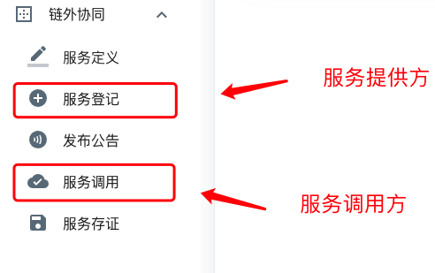

# 服务登记

!!! tip "提示"

    请先注册RepChain账号，并登录到RepChain-Dashboard管理控制台页面。

    接口协同所有操作均以此为前提。

!!! warning "注意"

    1. 服务登记分为服务提供方服务登记，服务调用方（调用登记）两种。

    2. 服务登记需要填写的表单内容完全一致，只是区分提供方与调用方。

    3. 其中，提供方可发布公告，而调用方只能查看公告，不可发布公告。

    4. 服务登记时，需要已经在接口定义定义好相关内容，否则无法提交服务登记。

## 一、描述

> 服务登记和服务调用，是为了服务方和调用方进行登记存证。
>
> 存证信息包含地址，端口号及服务定义，这样调用方即可知道需要调用哪些服务，而服务方可以知道有哪些调用方会调用自己的服务。
>
> 同时，由于有统一的接口定义规范约束，也防止了文档及定义不清晰的问题。服务方和调用方进行登记后，可以清晰的根据接口定义而实现相关接口及业务逻辑。

## 二、服务登记入口

如图：

* 菜单中服务登记为服务提供方登记界面。
* 菜单中服务调用为服务调用方登记界面。

## 三、使用示例

## 四、表单说明

### 登记名称 

> 约束：（必填）（不可更改）(不可重复)
>
> 类型：（字符串输入框）
>
> 描述：用于展示的登记名称，由用户定义。

### 地址

> 约束：（必填）
>
> 类型：（字符串输入框）
>
> 描述：登记方的服务器地址，请确保服务方或调用方可访问到此地址。

!!! warning "注意"

    使用[接入中间件](../04.接入中间件/01.1.0/01.前言.md)时，需要填写[接入中间件](../04.接入中间件/01.1.0/01.前言.md)所在地址。

### 端口

> 约束：（必填）（必须为数字）
>
> 类型：（数字输入框）
>
> 描述：地址对应的端口号。

!!! warning "注意"

    使用[接入中间件](../04.接入中间件/01.1.0/01.前言.md)时，需要填写配置文件中 `middleware.comServer.port` 所配置的端口号。

### 服务名

> 约束：（必填）
>
> 类型：（选择框）
>
> 描述：选择需要登记的服务名，选择后调用方需要实现接口登记中接口定义的内容。若为异步接口调用，则调用方需要实现应答方接口定义的内容。

