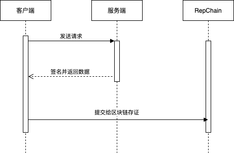

# 前言

!!! tip "提示"

    请使用[接入中间件](../04.接入中间件/01.1.0/01.前言.md)进行接口存证，可大大减少用户代码量。

## 一、前言

接口示例中并未引用一些Web框架，如Spring等，但注释中标注出一些可以使用单例的对象及配置。若要提高代码效率等，需要使用者自己封装成Bean。

## 二、存证过程-概要

首先，存证过程概要如下，主要为三个步骤：

>存证过程主要分为三个步骤：
>
>1. 对接口发起请求；
>2. 服务端对数据进行签名并返回数据；
>3. 提交给RepChain进行存证。

## 三、存证过程-详细

> 对上面概要进行详细说明，便于理解。

### 1. 对接口发起请求

* 构建接口请求参数
* 对接口请求参数进行[数据签名](../01.开始/01.引言.md#数据签名)
* 构建区块链存证Header（请求头）
* 发送请求

### 2. 服务端对数据签名并返回数据

* 服务端接收到请求后进行业务处理，获取返回数据
* 对返回数据进行[数据签名](../01.开始/01.引言.md#数据签名)
* 将返回结果和[数据签名](../01.开始/01.引言.md#数据签名)结果一同返回给客户端

### 3.  提交给RepChain存证

* 获取服务端返回数据
* 构建需要存证的[交易对象](../01.开始/01.引言.md#交易对象)
* 提交存证的[交易对象](../01.开始/01.引言.md#交易对象)给RepChain
* 完成接口调用

## 四、验证权限

> 权限验证各个系统会存在不同的方式进行验证，此处提供一个基于RepChain身份认证的权限认证。
>
> 通过对数据签名，调用方证书进行权限认证，认证通过则调用方拥有该接口调用权限。
>
> 此验证方式前提为调用方和服务方需要进行个人证书的交换，使双方都持有对方的证书，以便对签名数据进行数据验签。
