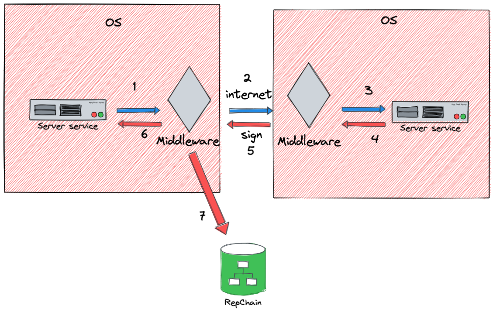

# 前言

## 一、说明

> 1. 接入中间件是为了帮助用户，解决接口协同时的存证、签名问题。
> 2. 接入中间件简化了数据存证、证书校验、数据签名等工作。
> 3. 同时使用gRPC协议进行数据传输，提高了数据传输效率。
> 4. 提供客户端连接中间件，减少了用户调用中间件时的代码量。
> 5. 封装文件传输、文件下载功能，进行文件传输时完全交由中间件操作，不用再去编写文件流的相关代码。

!!! warning "注意"

    每一个中间件对应一个宿主机，对应一套私钥和证书，中间件需要和宿主机部署在同一个操作系统中。

## 二、中间件基本原理

中间件基本原理如下：

!!! tip "提示"

    首先，中间件和服务部署在同一个操作系统中。

> 中间件基本原理： 

> 1. 请求方发起请求给中间件；
> 2. 中间件收到请求数据进行签名，并将数据转发给服务方中间件；
> 3. 服务方中间件获取请求数据校验签名，如果校验通过则，将请求数据发送给服务方接口；
> 4. 服务方返回数据给服务方中间件；
> 5. 服务方中间件对数据进行签名，签名后将数据返回给请求方中间件；
> 6. 请求方中间件返回数据给请求方；
> 7. 请求方中间件对数据进行签名，提交给RepChain进行存证。
