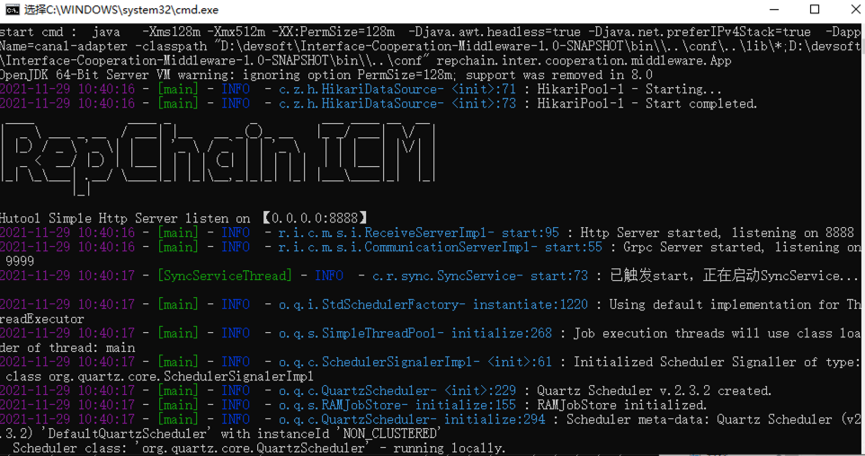

# 快速开始

## 一、安装JDK

> 下载jdk8，安装并根据自己的操作系统配置好环境变量。
> 
>推荐下载 [zulu-jdk-1.8](https://www.azul.com/downloads/?version=java-8-lts&package=jdk)

## 二、下载中间件

> 根据不同系统下载中间件的压缩包

### 1. Windows

下载 **Zip** 文件 [https://gitee.com/BTAJL/api-coord/attach_files/1104691/download/Interface-Cooperation-Middleware-2.0.0-RC2.0.0.zip](https://gitee.com/BTAJL/api-coord/attach_files/1104691/download/Interface-Cooperation-Middleware-2.0.0-RC2.0.0.zip)

### 2. Linux

* 使用 **wget** 下载 **tar**

  ```sh linenums="1"
  wget https://gitee.com/BTAJL/api-coord/attach_files/1104690/download/Interface-Cooperation-Middleware-2.0.0-RC2.0.0.tar
  ```
  
* 使用远程传输 **tar**

  > 可以先下载 **tar** 到本地电脑上，然后通过**SSH**工具将tar包传输到服务器中。

### 3. Mac

下载 **Zip** 文件或下载 **Tar** 文件。

## 三、解压

### 1. Windows

> 使用解压工具将 **Zip** 压缩包解压缩。

### 2. Linux

```sh linenums="1"
tar -xvf Interface-Cooperation-Middleware-2.0.0-RC2.0.0.tar
```

### 3. Mac

> 解压方式使用上述两种任选其一即可。

## 四、修改配置文件

* 打开文件 `conf/application-middle.yml`

* 填写 RepChain 相关地址

  ```yaml linenums="1"
  # repchain配置文件
  repchain:
    # repchain 地址
    host: 192.168.2.76:8081
    ...
  ```
* 填写你的服务器地址

> 由于中间件和宿主服务需要部署在同一个操作系统中，所以host填写127.0.0.1即可

  ```yaml linenums="1"
  ...
  # 中间件用于访问宿主服务的客户端配置
  recClient:
    # 服务地址
    host: 127.0.0.1
    # 服务端口号
    port: 8080    
    ...
  ```

## 五、启动中间件

### 1. Windows

* 终端执行启动命令

  ```sh linenums="1"
  bin\start.cmd
  ```

* 或双击启动脚本 `bin/start.cmd`



### 2. Linux 或 Mac

* 终端执行启动脚本 `bin/startup.sh`

  ```sh linenums="1"
  sh bin/startup.sh 
  ```

## 六、查看日志

> 中间件启动后会创建 `logs`文件夹，文件下会产生相应的日志文件。


## 七、停止中间件

### 1. Windows

* 关闭终端窗口或者在终端执行 `Ctrl + C`

### 2. Linux 或 Mac

* 终端执行停止脚本 `bin/shutdown.sh`

  ```sh linenums="1"
  sh bin/shutdown.sh 
  ```

  
