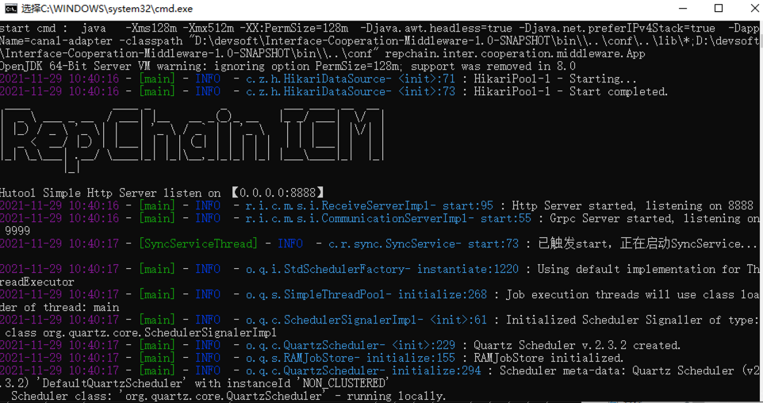

# 启动停止重启

## 一、启动

### 1. Windows

* 终端执行启动命令

  ```sh linenums="1"
  bin\start.cmd
  ```

* 或双击启动脚本 `bin/start.cmd`



### 2. Linux 或 Mac

* 终端执行启动脚本 `bin/startup.sh`

  ```sh linenums="1"
  sh bin/startup.sh 
  ```
## 二、停止

### 1. Windows

* 关闭终端窗口或者在终端执行 `Ctrl + C`

### 2. Linux 或 Mac

* 终端执行停止脚本 `bin/shutdown.sh`

  ```sh linenums="1"
  sh bin/shutdown.sh 
  ```
## 三、重启
### 1. Windows

* 暂不支持自动重启，请先停止中间件服务后再启动。

### 2. Linux 或 Mac

* 终端执行重启脚本 `bin/restart.sh`

  ```sh linenums="1"
  sh bin/restart.sh 
  ```

