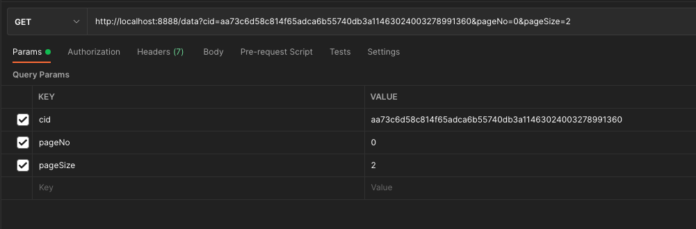

# 持久化

## 一、如何持久化

> 持久化数据会存储在请求方，通过客户端的 [ReqOption](./04.中间件客户端/04.API.md#reqoption) 来进行配置文件和数据的持久化。

## 二、查看持久化数据

* 通过数据库查看持数据

> 1. 文件持久化内容，默认位于中间件根目录 `file` 文件夹下，可在配置文件中修改默认路径
> 
> 2. 数据持久化内容，默认位于中间件根目录 `data` 文件夹下的 `repchain_mid.db` 文件中，此文件为sqlite文件，可通过sqlite驱动及其他工具进行查看。可在配置文件中修改持久化方式。当前版本支持sqlite绝对路径方式和mysql持久化方式。

* 通过api查看持数据

```java linenums="1"
InterCoResult result = MiddlewareClient
        // 填写中间件地址及端口号，及超时时间
        .create("http://localhost:8888", 50000)
        // 设置cid，pageNo，pageSize，所有参数均可以为空
        .data(PerReq.builder().cid("xxx").pageNo(0).pageSize(10).build());
```

* 通过REST查看

> 此处rest请求地址和端口为中间件的http服务的地址和端口。



